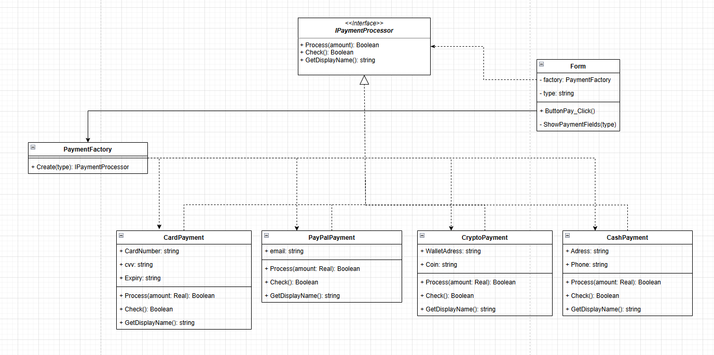

# Документация для лабораторной работы по ООАП

## Тема лабораторной: порождающие паттерны

### Предметная область: интернет-магазин

Проблема: существует приложение интернет-магазина, позволяющее выбирать способ оплаты (банковская карта, PayPal, криптовалюта, наличные при получении), и у каждого способа есть своя логика валидации данных и обработки платежа.

Решение: используя паттерн Фабричный метод, мы создаём интерфейс `IPaymentProcessor`, через который реализуются все способы оплаты, и класс `PaymentFactory`, который берёт на себя ответственность за создание нужного объекта — форма работает только через интерфейс и не знает о конкретных классах.

Диаграмма классов:

Вывод: использование данного паттерна упростило решение проблемы — форма перестала зависеть от конкретных типов платежей, каждый способ оплаты изолирован в отдельном классе, и добавление нового способа не требует изменения существующего кода, что позволило сохранить принципы ООП.
