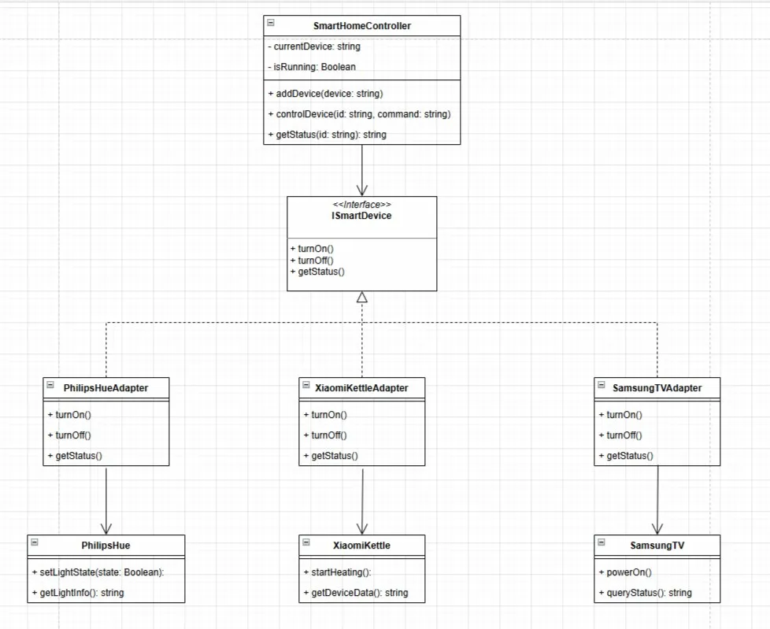

# Лабораторная работа №2 — Паттерн «Адаптер»

## Предметная область

Система управления умным домом, которая должна управлять устройствами от разных производителей: **лампой Philips Hue**, **чайником Xiaomi** и **телевизором Samsung**. У каждого устройства свой SDK с уникальным, несовместимым интерфейсом.

Устройства в системе:

| Устройство | Производитель | Класс SDK |
|---|---|---|
| Умная лампа | Philips | `PhilipsHue` |
| Умный чайник | Xiaomi | `XiaomiKettle` |
| Умный телевизор | Samsung | `SamsungTV` |

Управление устройствами осуществляется через GUI-приложение на C++ (Windows Forms). При нажатии кнопок «Включить» и «Выключить» устройство визуально меняет своё состояние на карточке.

---

## Описание проблемы

Каждое устройство предоставляет свой SDK с полностью различающимся API:

**PhilipsHue** — метод `setLightState(bool state)` для включения/выключения, метод `getLightInfo()` для получения состояния.

**XiaomiKettle** — методы `startHeating()` и `stopHeating()` для управления нагревом, метод `getDeviceData()` для получения данных.

**SamsungTV** — методы `powerOn()` и `powerOff()` для управления питанием, метод `queryStatus()` для получения статуса.

Несовместимость SDK:

| Что различается | PhilipsHue | XiaomiKettle | SamsungTV |
|---|---|---|---|
| Метод включения | `setLightState(true)` | `startHeating()` | `powerOn()` |
| Метод выключения | `setLightState(false)` | `stopHeating()` | `powerOff()` |
| Метод статуса | `getLightInfo()` | `getDeviceData()` | `queryStatus()` |
| Параметры включения | `bool state` | нет | нет |

Менять чужие SDK нельзя — это сторонний код. Менять свой контроллер из-за каждого нового устройства — нерационально.

В реализации без паттерна класс `SmartHomeController` напрямую зависит от всех трёх SDK, содержит объекты каждого из них и использует `if/else` для выбора нужного устройства. При добавлении четвёртого устройства нужно менять этот класс — нарушается Open/Closed Principle.

---

## Решение: применение паттерна «Адаптер»

### Единый интерфейс (Target)

Контроллер работает через один интерфейс с простыми методами:

```cpp
class ISmartDevice {
public:
    virtual void turnOn()  = 0;
    virtual void turnOff() = 0;
    virtual std::string getStatus() = 0;
    virtual std::string getName()   = 0;
    virtual ~ISmartDevice() = default;
};
```

Два метода управления и два метода информации. Контроллер не знает ни про какие `setLightState`, `startHeating` или `powerOn`.

### Адаптеры

Каждый адаптер реализует `ISmartDevice`, содержит внутри экземпляр чужого SDK и преобразует вызов:

**PhilipsHueAdapter** — вызывает `device.setLightState(true/false)` и `device.getLightInfo()`:

```cpp
class PhilipsHueAdapter : public ISmartDevice {
    PhilipsHue device;
public:
    void turnOn()  override { device.setLightState(true);  }
    void turnOff() override { device.setLightState(false); }
    std::string getStatus() override { return device.getLightInfo(); }
    std::string getName()   override { return "Лампа Philips Hue"; }
};
```

**XiaomiKettleAdapter** — вызывает `device.startHeating()` и `device.stopHeating()`.

**SamsungTVAdapter** — вызывает `device.powerOn()` и `device.powerOff()`.

### Использование единого интерфейса

Контроллер работает только через `ISmartDevice*` и не знает, какое устройство за адаптером:

```cpp
class SmartHomeController {
public:
    void controlDevice(ISmartDevice* device, const std::string& command) {
        if      (command == "on")  device->turnOn();
        else if (command == "off") device->turnOff();
    }

    std::string getStatus(ISmartDevice* device) {
        return device->getStatus();
    }
};
```

Контроллеру всё равно что внутри — Philips, Xiaomi или Samsung. Он вызывает `turnOn()` и получает результат.

---

## Диаграмма классов

Диаграмма классов для архитектуры с паттерном:



---

## Запуск

Оба проекта созданы в Visual Studio 2022 как **CLR Empty Project (.NET Framework)**.

**Проект с паттерном** (папка `WithPattern`):

Файлы проекта:
- `SmartHome.h` — сторонние устройства, интерфейс `ISmartDevice`, адаптеры, контроллер
- `MainForm.h` — GUI форма с визуальными карточками устройств
- `MainForm.cpp` — подключение формы
- `main.cpp` — точка входа

Настройки проекта: `Linker → System → SubSystem: Windows`, `Linker → Advanced → Entry Point: main`.

**Проект без паттерна** (папка `NoPattern`):

Те же четыре файла с теми же именами, но в `SmartHome.h` отсутствуют интерфейс и адаптеры — контроллер работает напрямую через `if/else`.

---

## Вывод

Внедрение паттерна «Адаптер» позволило:

1. **Привести несовместимые интерфейсы к единому виду** — три SDK с разными методами теперь работают через один интерфейс `ISmartDevice` с методами `turnOn()`, `turnOff()`, `getStatus()`.

2. **Устранить прямые зависимости** — контроллер не знает ни про `PhilipsHue`, ни про `XiaomiKettle`, ни про `SamsungTV`. Он работает только через `ISmartDevice`.

3. **Соблюсти Open/Closed Principle** — для добавления нового устройства достаточно создать один новый адаптер. Существующий код контроллера не меняется.

4. **Инкапсулировать преобразование вызовов** — конвертация единого `turnOn()` в нужный метод конкретного SDK скрыта внутри адаптера. Контроллер передаёт команду — адаптер сам разбирается как её выполнить.
