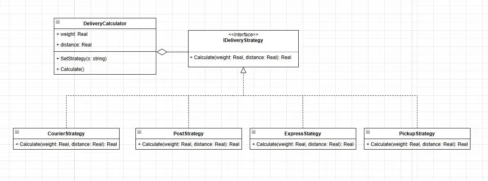

# Калькулятор стоимости доставки

**Паттерн проектирования:** Стратегия (Strategy)

---

## 1. Описание предметной области

Калькулятор стоимости доставки — это приложение, предназначенное для расчёта стоимости доставки товара в зависимости от выбранного способа. Пользователь указывает вес посылки (кг) и расстояние доставки (км), после чего система вычисляет итоговую стоимость по формуле, соответствующей выбранному способу доставки: Курьер, Почта, Экспресс или Самовывоз.

---

## 2. Описание проблемы

При наивной реализации логика расчёта стоимости для каждого способа доставки реализована непосредственно внутри GUI-класса в виде одного большого условного оператора. Это приводит к следующим проблемам:

- **Дублирование логики в интерфейсе** — GUI-класс вынужден знать формулы расчёта для каждого способа доставки, смешивая отображение и бизнес-логику.
- **Сложность расширения** — добавление нового способа доставки требует правки метода `_on_calculate` внутри GUI-класса, затрагивая уже работающий код.
- **Сложность тестирования** — формулы расчёта невозможно протестировать отдельно от интерфейса, так как они встроены в обработчик события кнопки.
- **Нарушение принципа единственной ответственности** — один класс отвечает одновременно за отображение и за вычисления.

---

## 3. Решение с помощью паттерна Стратегия

Паттерн Strategy решает проблему путём вынесения каждого алгоритма расчёта в отдельный класс, реализующий общий интерфейс `IDeliveryStrategy`. Контекст `DeliveryCalculator` хранит ссылку на текущую стратегию и делегирует ей вычисление, не зная конкретного алгоритма.

Общий процесс реализован в методе `Calculate()` класса `DeliveryCalculator` и включает следующие шаги:

| Шаг | Реализация |
|---|---|
| Выбор алгоритма | GUI вызывает `SetStrategy(s: string)` контекста |
| Передача данных | GUI устанавливает `weight` и `distance` контекста |
| Вычисление стоимости | Контекст делегирует вызов `Calculate()` текущей стратегии |
| Получение результата | Конкретная стратегия возвращает `float` по своей формуле |

Формулы расчёта по каждой стратегии:

| Стратегия | Формула |
|---|---|
| `CourierStrategy` | `200 + weight × 50 + distance × 10` |
| `PostStrategy` | `100 + weight × 30 + distance × 5` |
| `ExpressStrategy` | `500 + weight × 80 + distance × 20` |
| `PickupStrategy` | `0` (самовывоз всегда бесплатен) |

Таким образом, GUI-класс не содержит ни одной формулы. Добавление нового способа доставки сводится к созданию одного нового класса-стратегии без изменения существующего кода.

---

## 4. Диаграмма классов



---

## 5. Сравнение реализаций

### Без паттерна (`without_pattern.py`)

Весь расчёт стоимости находится внутри метода `_on_calculate` GUI-класса:

```python
def _on_calculate(self):
    # ... получение weight и distance из полей ввода ...

    if self.selected == "Курьер":
        cost = 200 + weight * 50 + distance * 10
    elif self.selected == "Почта":
        cost = 100 + weight * 30 + distance * 5
    elif self.selected == "Экспресс":
        cost = 500 + weight * 80 + distance * 20
    elif self.selected == "Самовывоз":
        cost = 0
```

GUI-класс знает формулы. При добавлении нового способа доставки необходимо редактировать этот метод.

### С паттерном (`with_pattern.py`)

GUI-класс не содержит формул — он лишь вызывает метод контекста:

```python
def _on_calculate(self):
    # ... получение weight и distance из полей ввода ...

    self.calculator.SetStrategy(self.selected)
    self.calculator.weight   = weight
    self.calculator.distance = distance
    cost = self.calculator.Calculate()
```

Каждая формула изолирована в собственном классе:

```python
class CourierStrategy(IDeliveryStrategy):
    def Calculate(self, weight: float, distance: float) -> float:
        return 200 + weight * 50 + distance * 10

class PostStrategy(IDeliveryStrategy):
    def Calculate(self, weight: float, distance: float) -> float:
        return 100 + weight * 30 + distance * 5
```

---

## 6. Вывод

Использование паттерна Стратегия позволило полностью разделить логику вычислений и логику отображения. Каждый алгоритм расчёта стоимости инкапсулирован в отдельном классе, реализующем интерфейс `IDeliveryStrategy`. Контекст `DeliveryCalculator` управляет выбором стратегии, не зная деталей её реализации. Архитектура приложения стала более понятной и структурированной. Внедрение паттерна позволяет легко добавлять новые способы доставки — достаточно создать новый класс с нужной формулой расчёта, не затрагивая ни GUI, ни существующие стратегии.
