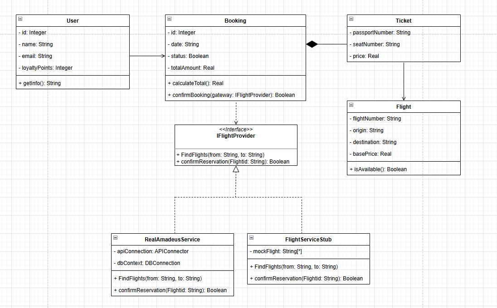

# Лабораторная работа № 4

**Тема:** Паттерн проектирования «Фиктивная служба» (Service Stub)

---

## Предметная область

Разработка модуля бронирования авиабилетов. Система управляет каталогом рейсов, позволяет пользователям выбирать и бронировать места, сохраняет данные о бронированиях в базу данных и инициирует подтверждение бронирования через внешний сервис авиакомпании (Amadeus API).

---

## Описание проблемы

Прямая интеграция с реальным API авиакомпании на этапе разработки и тестирования создаёт следующие проблемы:

- **Лимиты и стоимость** — запросы к реальному API часто платные или имеют жёсткий лимит (например, 50 запросов в день), что делает отладку затратной;
- **Динамичность данных** — цены и доступность рейсов меняются каждую минуту, что делает автоматическое тестирование логики «выгодной покупки» невозможным;
- **Скорость** — ответ от внешнего сервера Amadeus может занимать 2–5 секунд, что замедляет работу GUI и цикл отладки;
- **Жёсткая связанность** — бизнес-логика (класс `Booking`) напрямую зависит от конкретной реализации сервиса авиакомпании, что нарушает принцип инверсии зависимостей и затрудняет модульное тестирование.

Таким образом, требуется механизм, который:

- заменит внешний сервис авиакомпании на управляемую заглушку во время разработки;
- позволит мгновенно получать фиксированный список рейсов без обращения к сети;
- сохранит возможность прозрачного переключения на реальную службу с подключением к БД.

---

## Решение

Для решения проблемы в проекте реализован паттерн проектирования **Service Stub** (Фиктивная служба). Суть паттерна заключается в следующем:

- создание отдельного интерфейса `IFlightProvider`, описывающего контракт взаимодействия с сервисом авиарейсов;
- разделение логики на «боевую» реализацию `RealAmadeusService`, работающую с сетью и БД, и упрощённую заглушку `FlightServiceStub` для разработки;
- создана фиктивная служба — класс `FlightServiceStub`, который эмулирует работу внешнего API. Он не обращается к сети, а мгновенно возвращает заранее заданный список рейсов, позволяя тестировать GUI и логику бронирования без внешних зависимостей.

В проекте созданы следующие классы:

- **`IFlightProvider`** (Интерфейс) — определяет методы `fetchFlights()` и `confirmReservation()`, скрывая детали реализации от бизнес-логики. Класс `Booking` зависит только от этого интерфейса.
- **`RealAmadeusService`** (Реальная служба) — конкретная реализация интерфейса для «боевого» режима. Устанавливает подключение к MySQL, записывает бронирования в базу данных и содержит логику работы с реальным API.
- **`FlightServiceStub`** (Фиктивная служба) — тестовая заглушка. Не обращается к сети, мгновенно возвращает заранее прописанный список рейсов и всегда отвечает «Успешно» на запрос бронирования.

---

## Диаграмма классов

## Вывод

Внедрение паттерна «Фиктивная служба» позволило:

- **Реализовать принцип открытости/закрытости** — добавление нового сервиса авиакомпании или изменение логики не требует изменения кода класса `Booking` или GUI, достаточно создать новую реализацию `IFlightProvider`;
- **Устранить зависимость от внешней инфраструктуры** — во время разработки и отладки GUI не требуется подключение к Amadeus API или оплата запросов; `FlightServiceStub` мгновенно возвращает данные из памяти;
- **Взаимодействие с БД** — реальная служба `RealAmadeusService` полноценно взаимодействует с MySQL, записывая бронирования в таблицу `bookings`, что демонстрирует работу паттерна в условиях, приближённых к реальному развёртыванию;
- **Ускорить тестирование** — использование `FlightServiceStub` исключает задержки сети и позволяет мгновенно проверять отображение рейсов, фильтрацию и логику бронирования, не тратя реальные лимиты API.
